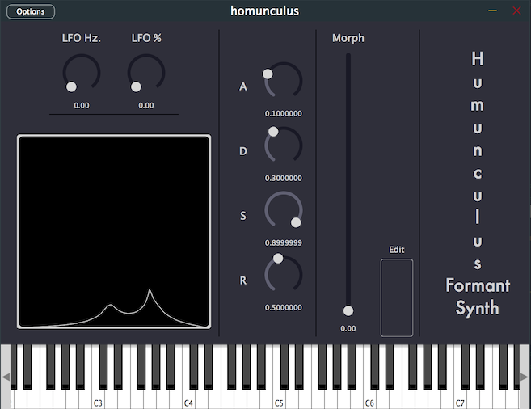
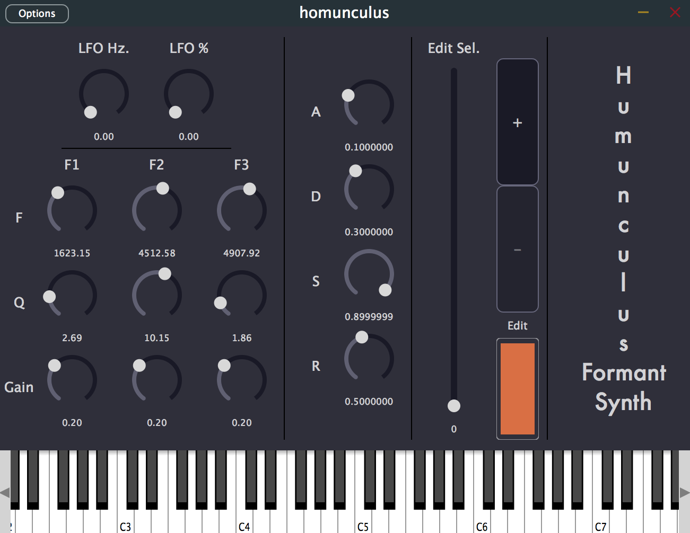

# Homunculus - a Formant Synth Plugin (JUCE, GPL3) #

Homunculus is a free and open source synth based on a very simplified model of the human voice. A band limited impulse train models glottal pulses, and a bank of resonant filters models the shape of the mouth, toungue, etc. While this synth can create sounds that are human-like, it is capable of producing a range of sounds.

## Installation ##

There are two procompiled installers:
- [macOS installer](https://github.com/tmroyal/homunculus/releases/download/v0.1.0/humunculus_0.1.0.dmg)
- [Windows installer](https://github.com/tmroyal/homunculus/releases/download/v0.1.0-beta/homunculus-0.1.0-windows.exe)

A Windows installer is fortcoming very soon.

## Using homunculus ##

### LFO and ADSR

This plugin includes a very simple LFO vibrato that can be controlled using the *LFO Hz* and *LFO %* knobs.

It also includes a very simple amplitude envelope that can be controlled using the *A*, *D*, *S*, and *R* knobs.

### Performance Mode Image

### Performance Mode

Interpolating between formants involves moving the slider labeled *Morph*. When the slider is moved, the formant visualizer will show an indicator of the frequency response of the formant filters.

To add, remove, and edit formant sets, press the edit button which will put the plugin into *Edit Mode*.

### Editor Mode Image

### Editor Mode

The editor mode allows the editing of **formant sets**. Each formant set includes three bandpass filters with editable frequency, Q, and gain. The parameters of each filter can be edited by the knobs on the left hand side of the plugin. The formants are labeled *F1*, *F2*, and *F3* and the paramters for each filter are labels *F* (frequency), *Q* and *Gain*.

To change the currently edited formant set, move the slider labeled *Edit Sel.*.

To add formants press the button labeled "+". To remove them, press the button labeled "-". Note, that there is a minimum of two formants required. (There is no maximum, unfortunately.)

When the plugin first launches, formant parameters are selected at random.

To go back to performance mode, press the *Edit* button.

## Motivation ##

I wanted to learn JUCE, general prinicples of software architecture, and some DSP (Blit and filtering). While I have a ways to go, I did not have the heart to let this languish on my hard drive: it's too spunky.

## Compiling from source ##

This code requires [JUCE](https://shop.juce.com/get-juce). It is also recommended that one uses the Projucer that comes with the software.

One should be able to simply open homunculus.jucer with the projucer. From there, one should be able to open the default IDE and compile from there. This has not been tested extensively.

